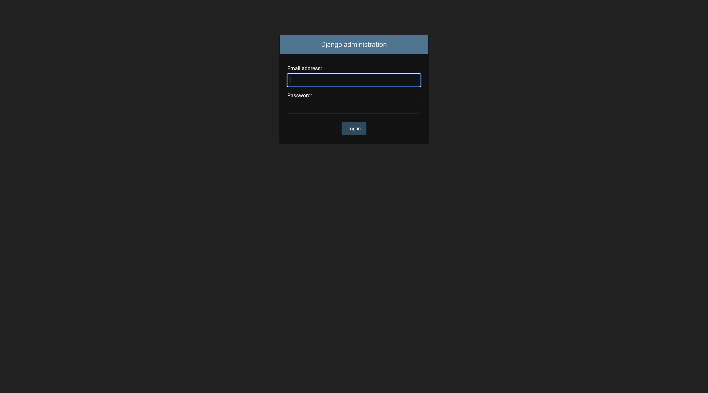
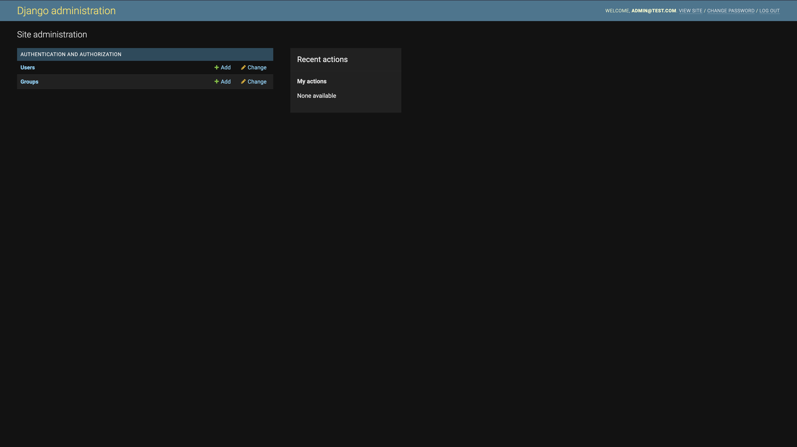

## DJANGO / MONGODB PROJECT WITH DJONGO ENGINE

# Projeyi çalıştırmak
- İlk aşamada env dosyalarının oluşturulması gerekmekte. Aşağıdaki örnek env bilgilerini güncelledikten sonra ana dizinde env klasörü açıp içine .env adında oluşturduğunuz dosyaya kaydediniz.

- Sonraki aşamada proje için gerekli kütüphaneleri kurmanız gerekmektedir. Proje geliştirilirken pipenv kullanılmıştır :
    - Aşağıdaki gibi pipenv'i kurabilirsiniz.

        ```bash
        $  pip install --user pipenv
        ```

    - Sonrasında proje dizininde pipenv'i çalıştırıp aktif etmeniz gerekmekte.

        ```bash
        $  pipenv install
        $  pipenv shell
        ```
    
- Buraya kadar bir problem olmaması halinde projeyi ayağa kaldırabilirsiniz. 

    ```bash
    $  python manage.py runserver 0:8000 
    # 0:8000 tercihe bağlı bir parametredir. Eğer bunu girerseniz proje 0.0.0.0:8000/ 'da çalışır.
    # Bu parametre verilmediği takdirde 127.0.0.1:8000/ 'de kullanabilirsiniz.
    ```


# Yeni App Oluşturmak
- Djangoda yeni app oluşturmak istiyorsanız birkaç adımdan oluşan yolu izlemeniz gerekir. Bu projede app'ler apps klasöründe toplanmıştır. Bu sebeple app olştururken path parametresi verilmesi gerekir.

    ```bash
    # Bu path verilmezse ana dizinde app oluşur ve bu hiyerarşiyi bozar.
    # Django'da custom bir yolda app oluşturmadan önce belirttiğiniz yoldaki klasörleri oluşturmalısınız. Aşağıdaki örnek için apps klasörü altında user klasörü olmalıdır.
    $  python manage.py startapp user apps/user
    ```

- Oluşan dosyalar arasında bulunan apps.py içinde bir kaç değişiklik yapılması gerekir. Bunun sebebi custom bir hiyerarşi kullanılmış olmasıdır.

    ```bash
    class UserConfig(AppConfig):
        default_auto_field = 'django.db.models.BigAutoField'
        name = 'apps.user'

    # Burada yapılması gereken şey name değişkenine doğru yolu tanımlamaktır. Default olarak 'user' gelmekte ve doğru yolu göstermemektedir.
    ```

- Oluşturduğunuz app'i config/settings klasörleri altındaki settings klasöründeki LOCAL_APPS'de tanımlamalısınız. Aksi takdirde Django bu app'i göremez.

    ```bash
    LOCAL_APPS = [
        'apps.user.apps.UserConfig'
    ]
    ```

- Oluşturulan app'ler içinde urls.py oluşmayacaktır. Bunu manuel oluşturmak gerekir. Burada oluşturulup ayarlanan urller daha sonra config klasörü altındaki urls.py dosyasında include edilmelidir.

    ```bash
    urlpatterns = [
        path('admin/', admin.site.urls),
        path("users/", include("apps.user.urls")),
    ]
    ```

# Süper Kullanıcı Oluşturmak

- Admine giriş yapabilmek için süper kullanıcı yetkisine sahip olmalısınız. Bunun için djangonun süper kullanıcı ekleme komutunu kullanabilirsiniz. Terminalden proje dizinine geldikten sonra:
    
    ```bash
    $ python manage.py createsuperuser
    $ Email address: # Buraya mail adresi girmelisiniz.
    $ Password: # Buraya şifre girmelisiniz.
    $ Password (again):  # Buraya şifreyi tekrar girmelisiniz.
    $ Bypass password validation and create user anyway? [y/N]: # Şifre güçsüz ise böyle bir soru ile karşılaşırsınız. y tuşuna basıp enter'a basabilirsiniz.

    $ Superuser created successfully. # Mesajını gördüğünüzde kullanıcı oluşturulmuş demektir.
    ```

- Projeyi ayağa kaldırıp aşağıdaki adrese girebilirsiniz. Az önce oluşturuduğunuz kullanıcı bilgileri ile giriş yapabilirsiniz.

    ```
    0.0.0.0:8000/admin/
    ``` 

# Ekran Görüntüleri

<p align="center">
  
  
</p>